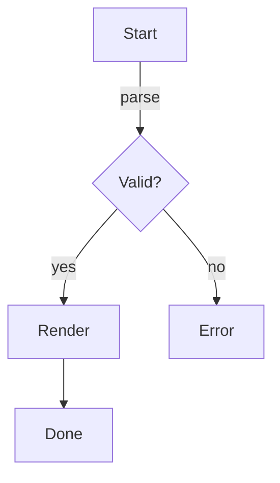
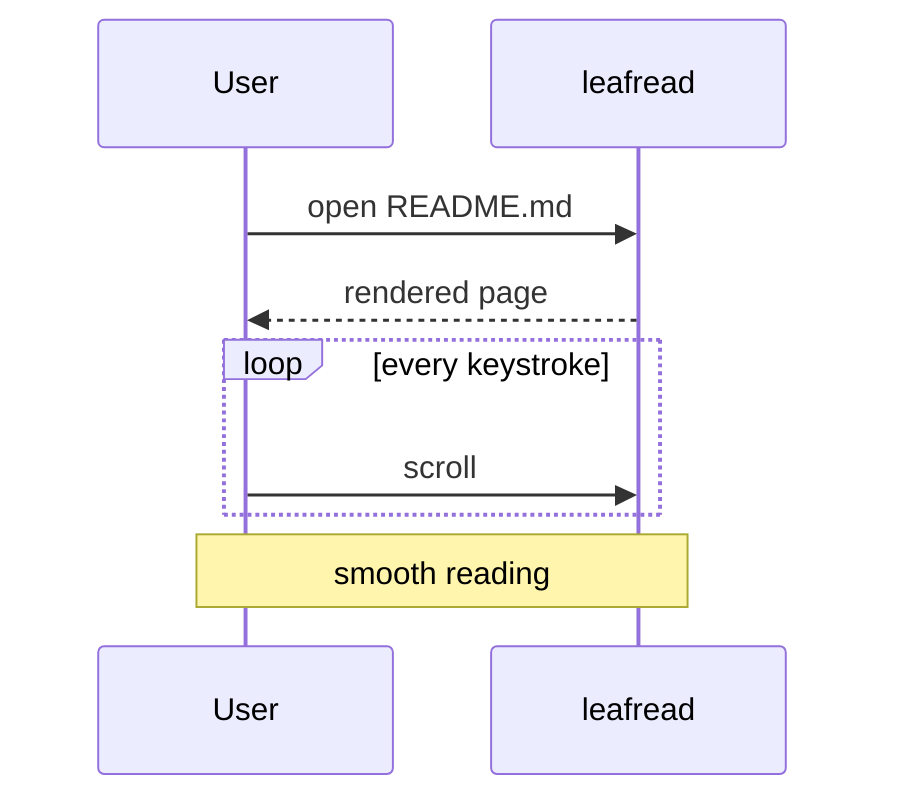

# Kitchen Sink

A **bold** idea, an *italic* aside, ~~struck out~~ text, `inline code`, a
[link to the docs](https://example.com/docs), an autolink https://example.org,
and an inline formula $E = mc^2$ in one paragraph.

## Lists

- First item
- Second item with **bold** and `code`
  - Nested item
    - Deeper item
- [x] Finished task
- [ ] Outstanding task 🔥

1. Ordered one
2. Ordered two
3. Ordered three

## Quote and alert

> Quoted text can span
> multiple lines.
>
> > Nested quote.

> [!WARNING]
> Alerts get their own colored labels.

## Table

| Language | Speed | Notes          |
|:---------|------:|:---------------|
| Rust     |  high | memory safe    |
| Go       |  fast | simple         |
| Python   |   low | batteries inc. |

## Code

```rust
fn main() {
    let greeting = "hello, terminal";
    println!("{greeting}");
}
```

```python
def fib(n):
    return n if n < 2 else fib(n - 1) + fib(n - 2)
```

## Math

The closed form is:

$$
\sum_{i=1}^{n} i = \frac{n(n+1)}{2}
$$

## Diagrams





## Footnote

Terminal readers are nice[^why].

[^why]: They stay in your terminal.

---

The end.
